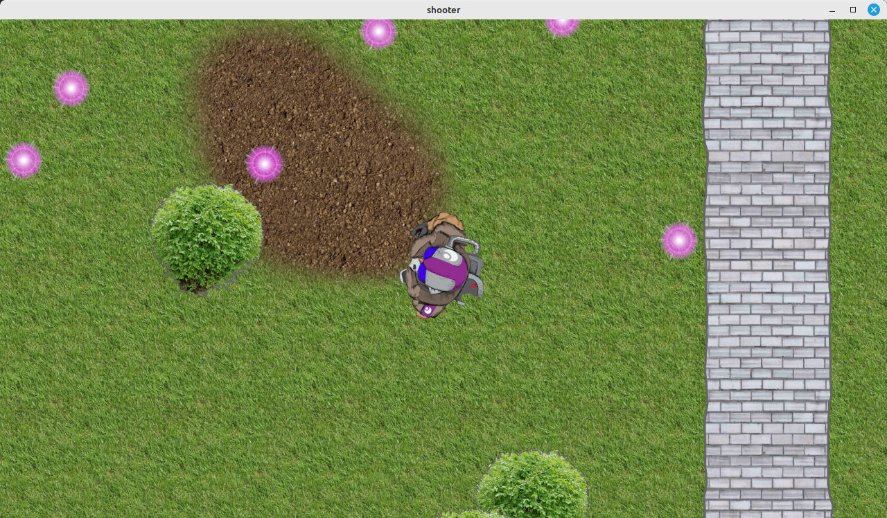

# shooter

A video game tech demo using Rust and Bevy.

*Please note*: This is primarily a learning and exporatory exercise, so expect subpar code quality and organization. The main goal is to prove the various technical requirements of making a specific game can be met with the given toolset. Other objectives are considered secondary at this time.



## Input

`W` `A` `S` `D` - Move  
Mouse - Aim
Left Click - Shoot  
`F11` - Toggle fullscreen  
`F12` - Toggle debug overlay  

## Basic Rust Development Environment Setup

* Install [vs code](https://code.visualstudio.com/download)
* Install `rust-analyzer` extension
  * Click `File` -> `Preferences` -> `Extensions`
  * Type "rust-analyzer"
  * Click `Install`
* Open shooter directory
  * Click `File` -> `Open Folder`
  * Select shooter directory

## Building

### Ubuntu/Debian

* Install [rust](https://www.rust-lang.org/tools/install)
* Install git (e.g. `sudo apt install git`)

```bash
git clone https://github.com/dubrowgn/shooter.git
cd shooter
./setup.sh
...
cargo run
```

### Windows

* Install [rust](https://www.rust-lang.org/tools/install)
* Install [VS2019 build tools](https://visualstudio.microsoft.com/visual-cpp-build-tools)
  * Select "Desktop development with C++"
  * Select Win10 SDK (needed for link.exe)
  * Select MSVC build tools
* Install [git](https://git-scm.com/downloads)
  * Or run `winget install git.git` in a terminal on Windows 11

```powershell
git clone https://github.com/dubrowgn/shooter.git
cd shooter
cargo run
```
